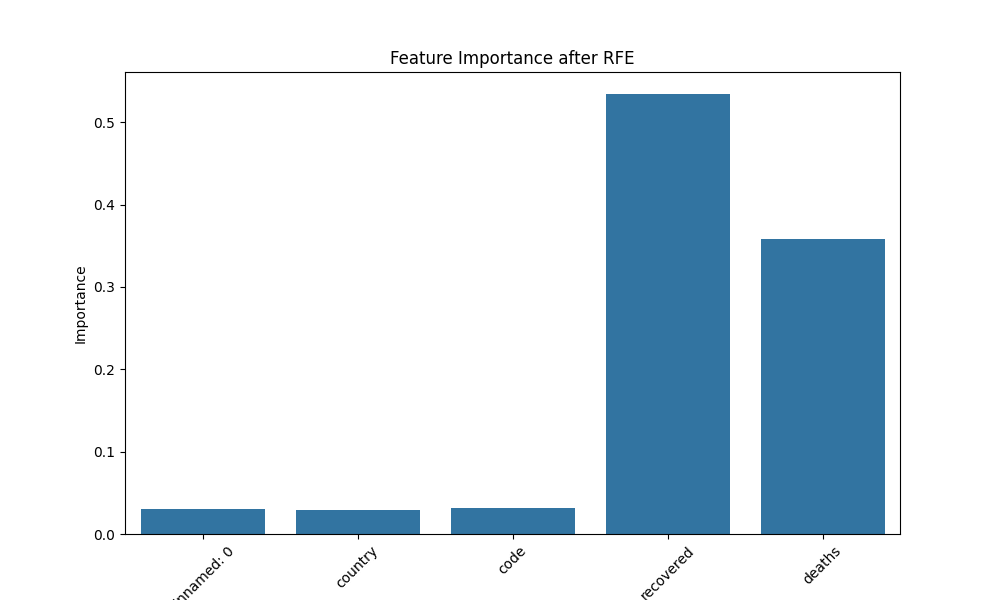
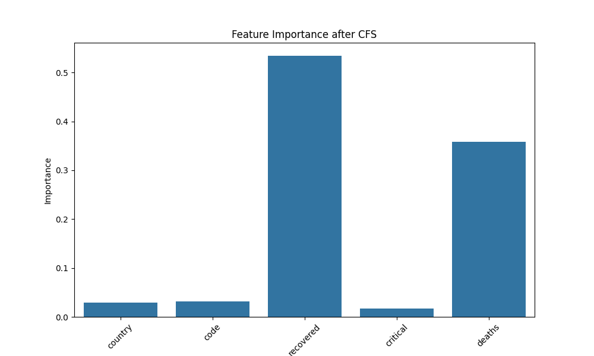
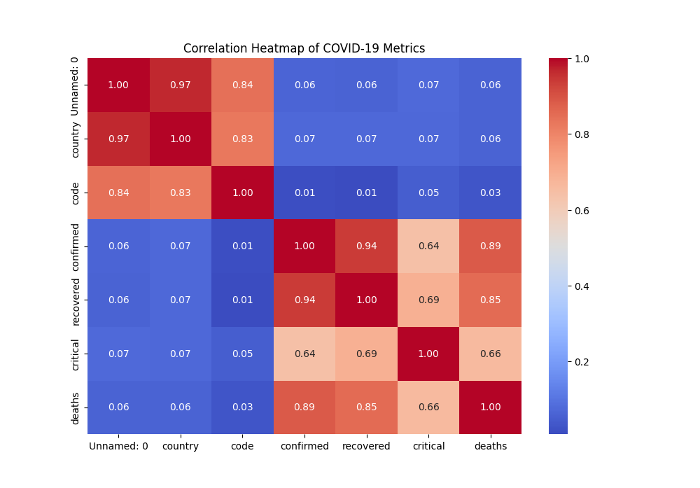
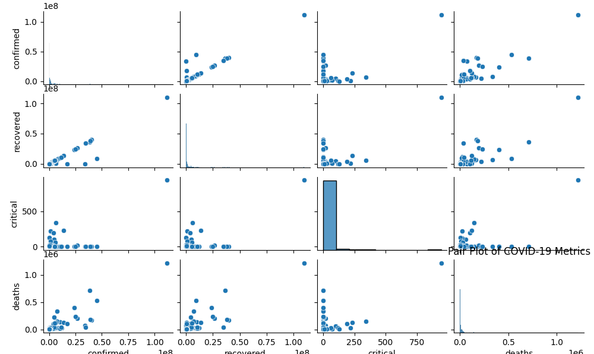
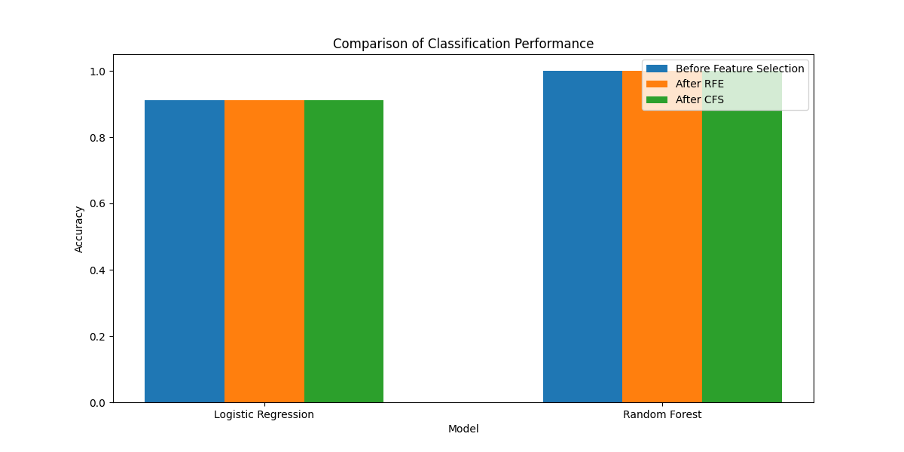

# COVID-19 Analysis with Feature Selection

This repository contains a machine learning project focused on analyzing a COVID-19 dataset. The project involves feature selection algorithms and classification models to evaluate their performance. It includes data visualizations, feature importance analysis, and performance comparisons.

## Dataset

The dataset used for this analysis is available [here](https://www.kaggle.com/datasets/vanka2003/covid-19-worldwide-refined-dataset).

## Repository Contents

- `ml.py`: The main script for data analysis, feature selection, and classification.
- `RESULTS.md`: Contains the results and analysis of feature selection and classification algorithms.
- `images/`: Directory containing visualization outputs such as correlation heatmaps, pair plots, and feature importance graphs.
- `LICENSE`: The license file for the project.

## Data Description

The dataset includes COVID-19 metrics:
- `confirmed`: Number of confirmed cases
- `recovered`: Number of recovered cases
- `critical`: Number of critical cases
- `deaths`: Number of deaths
- `country`: Country code
- `code`: Numeric code for each country

## Features Selected

- **Recursive Feature Elimination (RFE):** `country`, `code`, `recovered`, `critical`, `deaths`
- **Correlation-based Feature Selection (CFS):** `country`, `code`, `recovered`, `critical`, `deaths`

## Classification Algorithms Used

- **Logistic Regression**
- **Random Forest**

## Results

### Classification Performance

| Model              | Before Feature Selection | After RFE | After CFS |
|--------------------|---------------------------|-----------|-----------|
| Logistic Regression | 0.911111                  | 0.911111  | 0.911111  |
| Random Forest      | 1.000000                  | 1.000000  | 1.000000  |

### Visualizations

1. **Feature Importance After RFE**
   

2. **Feature Importance After CFS**
   

3. **Correlation Heatmap**
   

4. **Pair Plot**
   

5. **Comparison of Classification Performance**
   

## Installation

To run the analysis, you need to install the following Python libraries:

```bash
pip install pandas matplotlib seaborn scikit-learn
